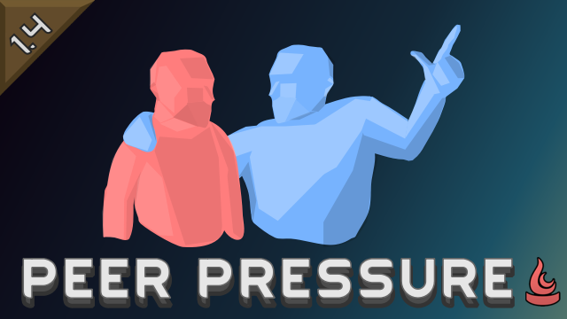

# Peer Pressure

   

[Peer Pressure](https://steamcommunity.com/sharedfiles/filedetails/?id=3057626086) is a mod for [RimWorld](https://rimworldgame.com/) which requires the [Ideology](https://rimworldgame.com/ideology/) DLC. With this mod, converting pawns to another ideology becomes more effective when they have a positive opinion of the proselytizer. Likewise, pawns are more likely to try to convert other pawns if they have a positive opinion of them. Shape the beliefs of your colony with ease!

## Mod Compatibility

| Mod                                                                                                                   | Compatible                                                                                                                                                 |
|-----------------------------------------------------------------------------------------------------------------------|------------------------------------------------------------------------------------------------------------------------------------------------------------|
| [Alpha Memes](https://steamcommunity.com/sharedfiles/filedetails/?id=2661356814)                                      | Yes                                                                                                                                                        |
| [Combat Extended](https://steamcommunity.com/workshop/filedetails/?id=2890901044)                                     | [Link](https://github.com/CombatExtended-Continued/CombatExtended/wiki/Frequently-Asked-Questions#does-mod-work-with-combat-extended-does-it-need-a-patch) |
| [Easy Conversions](https://steamcommunity.com/workshop/filedetails/?id=2885902723)                                    | Yes                                                                                                                                                        |
| [Vanilla Ideology Expanded - Memes and Structures](https://steamcommunity.com/sharedfiles/filedetails/?id=2636329500) | Yes                                                                                                                                                        |
| [T's Conversion Boosting Staff](https://steamcommunity.com/workshop/filedetails/?id=2890481507)                       | Yes                                                                                                                                                        |

## Frequently Asked Questions

**Is it not like this in RimWorld vanilla already?**

No. Check this link for details: [Conversion, RimWorld wiki](https://rimworldwiki.com/wiki/Ideoligion#Conversion).

**Can I safely add this mod to an existing save?**

Yes.

**Can I safely remove this mod from an existing save?**

Yes.

**Do I need to restart the game after changing the settings?**

No. Changes take effect immediately.

**Where should I place Peer Pressure in my mod list load order?**

Using [RimSort](https://github.com/oceancabbage/RimSort) or [RimPy](https://github.com/rimpy-custom/RimPy/releases) to sort your mod list should have optimal results.

## Development

To compile this mod on Windows, you will need to install the [.NET Framework 4.8 Developer Pack](https://dotnet.microsoft.com/en-us/download/dotnet-framework/net48). On Linux the packages you need vary depending on your distribution of choice. Dependencies are managed using NuGet. Your checkout must be placed in the RimWorld/Mods folder to let it find the RimWorld assemblies required for compilation.

## Contributions

This project encourages community involvement and contributions. Check the [CONTRIBUTING](CONTRIBUTING.md) file for details. Contributors can be checked in the [contributors list](https://github.com/joseasoler/peer-pressure/graphs/contributors).

• joseasoler: Programming

• NelsonArts: Art

## License

This project is licensed under the MIT license. Check the [LICENSE](LICENSE) file for details.

The preview image is licensed under the [Attribution-NonCommercial-NoDerivs 4.0 International](https://creativecommons.org/licenses/by-nc-nd/4.0/legalcode.en) license.

## Acknowledgements

Read the [ACKNOWLEDGEMENTS](ACKNOWLEDGEMENTS.md) file for details.
